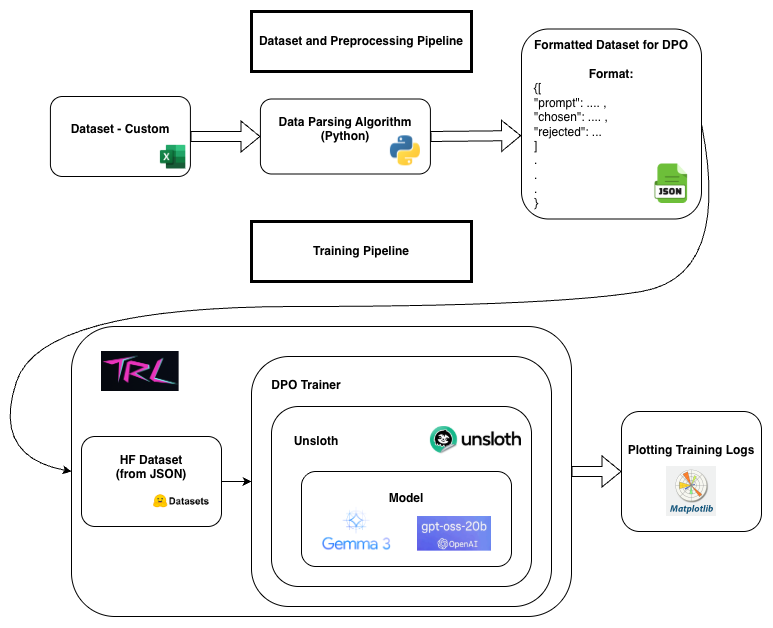

# DPO based RLHF alignment 

- This repo contains the complete code for training, inference, and plotting metrics. The repo also contains codes for preprocessing data and re-formatting it into TRL friendly RLHF format for DPO training and other helper functions

### Dataset
The 2 datasets used in this project are custom.

1. GenZ slang alignment dataset. We essentially map normal english sentences to their genZ counterparts(aka brainrot). We align an LLM to speak in this slang.
2. Stack Overflow Questions and Answers have "Upvotes" which makes it the most literal and useful example of "Human Preference Alignment". We align an LLM to give answers like the most upvoted answer in stack overflow, since generally LLMs have this habit of over explaining.

`helper_utils` folder has all the codes I have used for preprocessing the datasets into the required formats. The required format for a TRL friendly integration is as shown below.
```markdown
{
    "prompt": "How would you say .... ",
    "chosen": "Preferred way of .... ",
    "rejected": "Non-preferred way of ...."
}
```

### Models
We use 2 models in the experiment. `GPT-OSS-20B` and `Gemma3-1B` from huggingface. These models both have unsloth support and also are easily integratable with TRL as they are all belonging to the huggingface eco-system.

- Using low-rank adapters(LoRA) we can easily attach or remove them from the model to check vanilla vs aligned outputs using high level huggingface codes.

- Unsloth only wraps a model with certain functions so we don't need to worry about it making this uncompatible. 

### Training
Once we have the pre-processed and formatted data, we can directly plug this into training using `Huggingface Datasets`.

The code for training each mdoel with each dataset is names after the model and the dataset.

- Code for training Gemma3 for the GenZ alignment task is in `train_dpo_gemma_genz_slang.py`
- The other scripts follow the same naming convention as well.

### Plotting the Training/Eval Metrics
The code for plotting is `plot_metrics_dpo.py`. We feed in the logs from the `trainer_state.json` file in the TRL `output_dir`. This code plots 4 metrics for us.
1. Training Loss
2. Reward Margins
3. Reward Accuracy
4. Reward Comparison (Chosen vs Rejected)

Plots for all the models are locatd in the `training_log_plots` folder.

### Inference and Qualitative Evaluation
Code for inference follows the similar naming convention as the training scripts. 

- Code for inferring Vanilla vs DPO aligned outputs for Gemma3 for the GenZ alignment task is in `infer_dpo_gemma_genz_slang.py`
- The other scripts follow the same naming convention as well.

> Main library & hardware requirements for the assignment
1. transformers, unsloth, TRL, matplotlib, pandas, numpy, torch
2. NVIDIA RTX 3090 and above with atleast 24GB of VRAM

### The following diagram shows the entire pipeline
